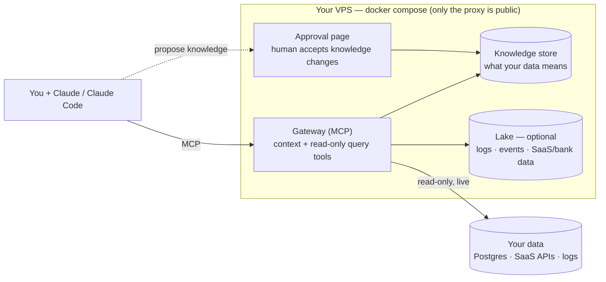

# Setoku

**Setoku gives Claude the context to answer questions about your data — and a safe, read-only way to query it — on your own server and your own Claude subscription.**

It's basically institutional memory: the stuff about your data that usually lives in people's heads, written down where an agent can use it. We built it for our own two-person company.

- **The problem.** What your data *means* lives in people's heads — which metric is the real one, why "paying customer" is trickier than it looks, the gotchas that make an obvious query wrong. Agents never had that, so they guess and get it confidently wrong.
- **What it does.** It remembers those definitions and gotchas and hands them to Claude right before it answers, so it computes things the way you actually do.
- **It's safe to point at your data.** The agent only runs read-only, audited queries, and can't change what Setoku knows — a human approves that, outside the agent's loop.
- **It's cheap.** No AI runs in Setoku itself; the thinking happens in the Claude you already pay for. A whole deployment is one small VPS.

Today it's mostly about **data** (what your tables and metrics mean). The same idea could hold more — personal context, house design conventions — see [docs/memory.md](./docs/memory.md).

_Setoku = **set** (math) × **oku** (奥, innermost): the innermost layer underneath your AI. (Naming: [NAMES.md](./NAMES.md). Full design history: [SPEC.md](./SPEC.md).)_

> **Status:** working prototype. One box serves a live pilot today — querying its Postgres read-only, ingesting its logs, Slack, and bank data, and answering questions through Claude.

---

## What it is

Setoku is a small self-hosted server that sits between your AI (Claude) and your data. It does two things:

1. **Holds curated knowledge about your data** — what your tables and metrics actually mean, the canonical SQL for each metric, and the gotchas that make naive queries wrong (e.g. "active user" excludes internal test accounts; refunds must be subtracted from revenue; a status column is current-state only, so you count events from the log table instead).
2. **Gives the agent a governed way to query** — read-only, with a row cap, a statement timeout, a table allow-list, and an append-only audit log of who ran what.

The agent looks up the context first, then runs the query — so it answers the way your business actually computes things instead of guessing from column names.

It ships **tools, not models**. No AI runs on the server; all the reasoning happens in your Claude. That means no AI API keys and no per-query AI cost — a whole deployment is one small VPS plus the Claude seats your team already has.

## Why we built it

We're a two-person company and we run on Claude. The problem was simple: Claude is good at SQL but doesn't know our business. It would write a clean query against the wrong definition — what "paying customer" means, which metric counts, the small gotchas that make an obvious query wrong — and give us a confident, wrong number. The knowledge to get it right was in our heads, not anywhere an agent could read.

We didn't want to pay for a second AI to fix that; we already pay for Claude. So Setoku doesn't run a model of its own — it just hands context and a safe way to query to the Claude we already have. A whole deployment is one small box.

We also didn't want an agent able to do damage with our data, so queries are read-only (the database enforces it) and the agent can't change what Setoku knows — a human signs off on that, outside the loop.

It's a small thing, but it's been useful for us. Maybe it's useful for you.

## How to deploy it

One command on a fresh Ubuntu VPS (~$12/mo):

```bash
git clone https://github.com/Hedgy-Labs/setoku /opt/setoku && cd /opt/setoku
./deploy/bootstrap.sh
```

It installs Docker, generates secrets, gets a real HTTPS certificate (uses `<your-ip>.sslip.io` if you don't have a domain yet), and brings the whole stack up. It prints the command to connect Claude and the token for log drains.

Then point Claude at the box and run `/setoku:onboard` in a business repo — it wires up your database (the credential stays in your env; only the env-var *name* goes in config), checks the connection, and generates the first knowledge from your code.

## High level architecture

Everything is one `docker compose` on one VPS. Only the web proxy faces the internet; the databases are never exposed.



**Two pieces:**

1. **A provisioner** that hooks each data source up on demand — query a Postgres live (read-only), ingest logs and events, pull an API on a schedule, archive Slack. You maintain a handful of proven patterns, not one connector per vendor.
2. **A gateway** that gives agents two kinds of tools over MCP: *context* tools (look up what the data means) and *data* tools (`get_schema`, `run_query` — read-only, audited, routed to whichever store the data lives in).

**The membrane — what makes it injection-safe.** Agents can only *propose* knowledge; a human accepts it on the approval page, outside the agent loop. The deployed gateway holds no tool that commits curated knowledge. So an agent tricked by a malicious log line can propose nonsense, but nothing takes effect without a human click.

**What runs in the box:**

| Component | Role |
|---|---|
| **Caddy** | HTTPS edge — the only public-facing container |
| **Gateway** | the MCP server (context + query tools) and the `/admin` approval surface |
| **Postgres** | the knowledge store and admin accounts |
| **ClickHouse + Vector** *(optional)* | a lake for logs/events/telemetry — only when there's more than Postgres should hold |

Your operational data stays where it is — Setoku queries Postgres **live and read-only**; it doesn't copy your database. Read-only is enforced by the database engine (a SELECT-only role), not by parsing SQL in our code.

---

Apache-2.0 ([LICENSE](./LICENSE)). Contributing: [CONTRIBUTING.md](./CONTRIBUTING.md) (DCO sign-off). Security & token posture: [SECURITY.md](./SECURITY.md). Design & roadmap: [SPEC.md](./SPEC.md). The safety invariants the code preserves (I1–I9): [docs/invariants.md](./docs/invariants.md).
