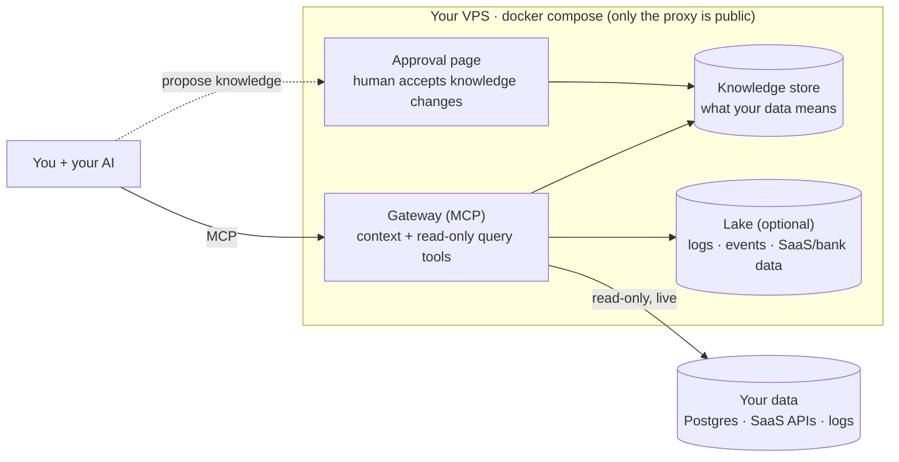

# Setoku

**A tool for your AI to do two things: reach your data, and understand it better over time.**

- **The problem.** What your company knows about itself lives in people's heads: which metric is the real one, why "paying customer" is trickier than it looks, the gotchas that make an obvious query wrong, what the logs say when something breaks. Agents never had that, so they guess and get it confidently wrong.
- **What it does.** Setoku is the shared, curated memory of what your data and operations *mean*. It remembers those definitions and gotchas and hands them to your AI right before it answers, so it computes things the way your company actually does, and gets better at it the more you use it.
- **It's safe to point at your data.** The agent only runs read-only, audited queries, and can't change what Setoku knows; a human approves that, outside the agent's loop.
- **It's cheap.** No AI runs in Setoku itself; the thinking happens in the AI you already pay for. A whole deployment is one small VPS.

One brain, two kinds of question: *"what was revenue last quarter?"* and *"what's been erroring since the deploy?"* The business metric and the operational truth, both answered the same read-only way.

Today the brain mostly holds **data and operations** (what your tables, metrics, and logs mean). The same idea could hold more (personal context, house design conventions); see [docs/memory.md](./docs/memory.md).

_Setoku = **set** (math) × **oku** (奥, innermost): the innermost layer underneath your AI.

---

## Try it live

There's a public demo wired to a synthetic dataset for a fictional pro baseball club, the **Bonita Bulldogs**, covering ticketing, fans/CRM, sponsorship, merchandise, concessions, staffing, payroll, marketing, gameday incidents, and broadcast media rights.

1. In **Claude.ai** (or any MCP client), open **Settings → Connectors → Add custom connector** and paste this as the server URL (there's no header field; the token rides in the URL):
   ```
   https://demo.setoku.com/i/55e767ea376aa3783cfb4653e2bf81772876b9b5c36339d9
   ```
2. Ask in plain language. Setoku feeds your AI the curated definitions first (comps are free, `scanned` = attended, money is in cents), so it computes the number the way the business actually does instead of guessing from column names. Try:
   - *"How many unique fans do we have?"* The CRM has duplicates and test records; Setoku dedupes by normalized email instead of a naive `COUNT(*)`.
   - *"What was our ticket revenue this season, and which games sold best?"* It handles cents vs dollars and excludes refunds, exchanges, and comps.
   - *"What's our season-ticket renewal rate?"* It spans three seasons of ticketing history.
   - *"What's our total annual revenue, and how much of it is media rights?"* It combines five systems with reconciled units (~$180–200M; media rights is the biggest line, ~$90M).
   - *"What's our total merchandise revenue?"* Setoku flags that the data is online only (most merch is via Fanatics, not here) instead of returning a wrong total.

Full walkthrough, the `/admin` approval surface, and the data model: [`demo/README.md`](./demo/README.md).

---

## How it works

Setoku is a small self-hosted MCP server that sits between your AI and your data. It works with any MCP client (Claude today). It does two things:

1. **Holds curated knowledge about your data**: what your tables and metrics actually mean, the canonical SQL for each metric, and the gotchas that make naive queries wrong (e.g. "active user" excludes internal test accounts; refunds must be subtracted from revenue; a status column is current-state only, so you count events from the log table instead).
2. **Gives the agent a read-only way to query**: with a row cap, a statement timeout, a table allow-list, and an append-only audit log of who ran what.

The agent looks up the context first, then runs the query, so it answers the way your business actually computes things instead of guessing from column names.

It ships **tools, not models**. No AI runs on the server; the reasoning happens in the AI you already use. That means no AI API keys and no per-query AI cost: a whole deployment is one small VPS plus the AI seats your team already has.

## Why we built it

**We're curious.** There are plenty of AI memory stores, and plenty of data gateways. Stapling the two together, and nudging the agent to gather knowledge about the data as it goes, seemed worth trying and fun to tinker with.

**We're cheap.** We wanted something that runs on one small box, works on a Pro/Max subscription or a cheap model with no added inference cost, mostly sets itself up (no field engineer to pay for), stays portable between providers, and is open source.

**We and some friends wanted the same thing.**

- **Hedgy**: keep scaling without hiring. Debug from live logs and data, find growth levers, and match candidates and companies better with more data.
- **Baggu**: give employees state-of-the-art tools. Faster onboarding, and a safe way to build against real data.
- **Tlon**: experimenting with giving agents curated data to work from.
- **Sports analysts**: query across data that doesn't usually sit together.
- **Academic labs**: think through hypotheses against real papers, data, and drafts.

It's a small thing, but it's been useful for us. Maybe it's useful for you.

## How to deploy it

Setoku installs as a Claude Code plugin, so setup runs inside Claude. Add the plugin (no server needed yet), then run onboarding from your main project directory, the codebase you want Setoku to learn from:

```
/plugin marketplace add Hedgy-Labs/setoku
/plugin install setoku@setoku
/setoku:onboard
```

`/setoku:onboard` stands up the server (provisions and bootstraps a small VPS, or connects to one you already have), connects this Claude to it, wires your database read-only, and generates the first knowledge from your code. You'll need a VPS it can use (~$12/mo) and an admin connection URL for the database. You stay in the loop for anything that touches your data. (Or just tell Claude "set up setoku.")

<details>
<summary>Or stand up the server by hand</summary>

One command on a fresh Ubuntu VPS (~$12/mo):

```bash
git clone https://github.com/Hedgy-Labs/setoku /opt/setoku && cd /opt/setoku
SETOKU_ADMIN_USER=you ./deploy/bootstrap.sh
```

It installs Docker, generates secrets, gets a real HTTPS certificate (uses `<your-ip>.sslip.io` if you don't have a domain yet), and brings the whole stack up. It prints the command to connect your AI and the token for log drains. (`SETOKU_ADMIN_USER` is the `/admin` login it creates; set it so the script runs unattended, or omit it and it asks once, interactively.)

Then add the plugin and run `/setoku:onboard` from your project; it detects the box you just made, wires up your database (the credential stays in your env; only the env-var *name* goes in config), and generates the first knowledge from your code.

</details>

The point isn't that an agent can query your Postgres; if you're an engineer, it already can. The point is that the *meaning* gets captured once and **shared with the whole team**: `add-teammate` mints a connector for anyone, so a non-technical teammate can query and visualize their own data in plain language ("show me signups by week") and get the *right* number, because your annotations ride along.

## High level architecture

Everything is one `docker compose` on one VPS. Only the web proxy faces the internet; the databases are never exposed.



**Two pieces:**

1. **A provisioner** that hooks each data source up on demand: query a Postgres live (read-only), ingest logs and events, pull an API on a schedule, archive Slack. You maintain a handful of proven patterns, not one connector per vendor.
2. **A gateway** that gives agents two kinds of tools over MCP: *context* tools (look up what the data means) and *data* tools (`get_schema`, `run_query`; read-only, audited, routed to whichever store the data lives in).

**The membrane: what makes it injection-safe.** Agents can only *propose* knowledge; a human accepts it on the approval page, outside the agent loop. The deployed gateway holds no tool that commits curated knowledge. So an agent tricked by a malicious log line can propose nonsense, but nothing takes effect without a human click.

**What runs in the box:**

| Component | Role |
|---|---|
| **Caddy** | HTTPS edge, the only public-facing container |
| **Gateway** | the MCP server (context + query tools) and the `/admin` approval surface |
| **Postgres** | the knowledge store and admin accounts |
| **ClickHouse + Vector** *(optional)* | a lake for logs/events/telemetry, only when there's more than Postgres should hold |

Your operational data stays where it is: Setoku queries Postgres **live and read-only**; it doesn't copy your database. Read-only is enforced by the database engine (a SELECT-only role), not by parsing SQL in our code.

---

Apache-2.0 ([LICENSE](./LICENSE)). Contributing: [CONTRIBUTING.md](./CONTRIBUTING.md) (DCO sign-off). Security & token posture: [SECURITY.md](./SECURITY.md). Design & roadmap: [SPEC.md](./SPEC.md). The safety invariants the code preserves (I1–I9): [docs/invariants.md](./docs/invariants.md). The structured fact model + compaction/auto-judgement design (#10): [docs/knowledge-facts.md](./docs/knowledge-facts.md).
