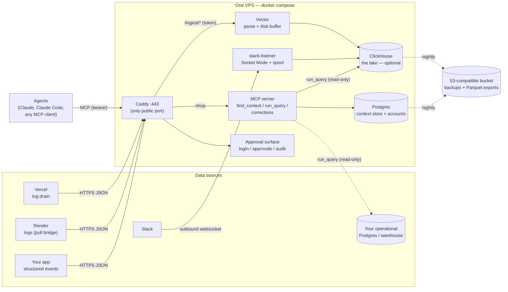
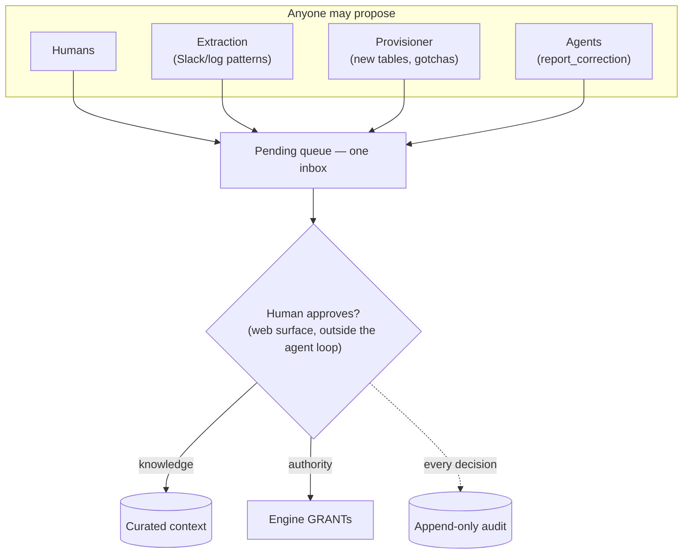

# Setoku

**Governed, context-aware analytics for AI agents — over your data, wherever it lives, on your own Claude subscription.**

Setoku stores curated knowledge *about* a business's data — entity semantics,
canonical metric definitions, known-good queries, and the gotchas that make
naive SQL wrong — and exposes it to AI agents over MCP. The agent retrieves
that context first, then runs governed, read-only SQL, so it answers the way
your business actually computes things instead of guessing from column names.

**All intelligence lives in the user's agent.** Setoku ships *tools* (over MCP),
not models: no AI API keys, no server-side inference, zero marginal AI cost. An
org's whole deployment is one small VPS plus the Claude subscriptions its people
already have.

_Setoku = **set** (math) × **oku** (奥, innermost): the innermost set — the
intelligence layer underneath your AI._ (Naming saga: [NAMES.md](./NAMES.md);
full design history: [SPEC.md](./SPEC.md).)

> **Status:** working prototype. A live single-box deploy serves the pilot
> tenant, ingesting its Vercel + Render logs and querying its Postgres
> read-only. See [Status & roadmap](#status--roadmap).

---

## How it works

```
You ⇄ Claude / Claude Code  ──MCP──▶  Setoku gateway  ──▶  context layer   (verified business knowledge; corrections, revisions, audit)
        (your seat)                   (one small VPS)   ──▶  your data       (read-only, row-capped, audited — see "storage is pluggable")
```

- **Context tools** — `find_context`, `list_entities`, `describe_entity`,
  `get_metric`: retrieval over a versioned, human-verified knowledge store.
- **Data tools** — `get_schema`, `run_query`: live access through a choke point —
  READ ONLY, statement timeout, row cap, table allow-list, append-only audit log
  with per-user attribution. `run_query` routes by **dialect** to whichever store
  the data lives in.
- **The membrane** — agents can only *propose* knowledge (`report_correction` →
  a pending queue); a human accepts on the web approval surface, outside the
  agent loop. The deployed gateway holds no tool that commits curated knowledge
  (see [Invariants](#invariants), I2/I9).
- **Skills** (Claude Code plugin) — `/setoku:onboard`, `/setoku:generate`
  (derive the context layer from your code, `file:line`-grounded),
  `/setoku:analyst`, `/setoku:curate`, `/setoku:eval`.

### Storage is pluggable — the context layer is the constant

Setoku is not a warehouse and not an ELT tool. It queries data *where it already
lives* and adds the layer enterprises actually lack: verified semantics,
governance, and an agent that uses both. The query backend adapts to the
customer:

| Customer shape | Where the data is | Setoku's storage role |
|---|---|---|
| Operational-DB shop | one Postgres | **query it live**, read-only — never copied (freshness is the point) |
| Log/telemetry-heavy (the pilot) | logs/events not in any DB | **bundle a lake** to ingest into — Postgres by default, ClickHouse at scale |
| Has a warehouse / no warehouse but many SaaS | BigQuery / Snowflake | **adapter over their warehouse** (roadmap) — no bundled store |

The bundled **ClickHouse lake is therefore optional, not mandatory** — it earns
its place only for telemetry volume Postgres can't comfortably hold. "All your
data in one engine" is *not* a goal; copying mutable relational state into a
columnar append-store is the warehouse-ETL tax Setoku exists to avoid. The
unification happens at the knowledge/query layer, not the storage engine.

---

## Quickstart

**Deploy your own box** (one command on a fresh Ubuntu VPS — Hetzner CX/CCX or
similar, ~$8–20/mo):

```bash
git clone https://github.com/Hedgy-Labs/setoku /opt/setoku && cd /opt/setoku
./deploy/bootstrap.sh           # installs Docker, generates secrets, brings the stack up
```

With no domain it uses `<public-ip>.sslip.io` for a real Let's Encrypt cert and
zero DNS setup; pass a hostname to use your own. The script prints the
`claude mcp add …` command to connect, and the ingest token for log drains. See
[`deploy/hetzner.md`](./deploy/hetzner.md) for the hardened runbook and
[`deploy/README.md`](./deploy/README.md) for the gateway-only profile.

**Or use the Claude Code plugin** (local stdio, query an existing Postgres):

```bash
claude plugin marketplace add Hedgy-Labs/setoku
claude plugin install setoku@setoku
```

Then run `/setoku:onboard` in any business repo — it writes `.setoku/config.json`
(your DB credential stays in your env; only the *env var name* goes in config),
verifies connectivity, offers to generate the context layer from your code, and
runs your first question end-to-end. Commit `.setoku/`; audit logs are
auto-gitignored.

### Development

```bash
bun install
bun run typecheck
bun test          # e2e needs a local Postgres (unix socket at /tmp by default;
                  # override SETOKU_E2E_PG_HOST / SETOKU_E2E_DB_URL / …).
                  # the lake-dialect suite skips unless a ClickHouse is reachable:
                  #   docker run --rm -d -p 18123:8123 -e CLICKHOUSE_PASSWORD=pw clickhouse/clickhouse-server:25.3
                  #   SETOKU_E2E_CH_URL=http://default:pw@127.0.0.1:18123/default bun test
```

The suite drives the exact server the plugin ships, over a real MCP client, against
a synthetic shop schema with deliberate gotchas (soft deletes, refunds, integer
cents): tool surface, allow-list scoping, read-only enforcement (incl. CTE-smuggled
writes), row caps, timeouts, retrieval quality, corrections, audit attribution,
the Vector transforms (golden-file), the lake dialect, and the Slack listener's
durability.

---

## Architecture (decided — do not relitigate without a written reason)

**Figure 1 — the whole system.** Everything inside the box is one `docker compose
up` on one small VPS (reference: a Hetzner-class CX/CCX, ~$8–20/mo). Only Caddy
faces the internet; all intelligence lives in the connecting agents (I8).



| Layer | Choice | Why |
|---|---|---|
| Context store + accounts | **Postgres** (FTS + trigram; pgvector optional) | Scales with *schema complexity*, not data volume — thousands of docs at worst. Boring, transactional. Retrieval defaults to FTS (zero inference, no keys — see I8); embeddings are an opt-in upgrade. |
| Lake / event store *(optional)* | **ClickHouse, single node** (Apache-2.0) | Live ingest, columnar aggregation, billions of rows on one box. Opt-in (`lake` profile) — only when telemetry outgrows Postgres. |
| Log/event pipeline | **Vector** (MPL-2.0) in *receiver* mode | First-class ClickHouse sink, disk buffering when the sink is down. Sources push to it; it does not tail files. |
| Archive / portability | **Parquet on S3-compatible object storage** | ClickHouse reads/writes it natively; any engine can read the exports. Migration (bigger node → ClickHouse Cloud) never strands data. |
| Edge / TLS | **Caddy** | Auto-HTTPS (incl. sslip.io for no-domain deploys); the only public-facing container. |
| Deployment | **Single VPS, docker-compose** (Hetzner-class, ~$8–20/mo) | One box, one bill. Everything on localhost; databases never exposed. The compose file *is* the product's body and reference deployment. Multi-arch images. |

**Explicitly rejected:** SurrealDB (BSL, wrong engine for event volume); Fly.io /
Render / Railway *as the hosting target* (per-service RAM pricing is 3–10× a raw
VPS for an always-on stateful stack, and they fight the compose model — see the
cost table in the design notes); DuckDB as the serving lake (single-writer).

### Data sources (resist the connector matrix)

The supported pushed/pulled sources are deliberately few — **Vercel, Render,
Slack, and a first-party events endpoint** — plus querying the customer's own
Postgres/warehouse live. Setoku is *not* a Fivetran: it does not own a matrix of
SaaS connectors. For a business whose data is scattered across many SaaS tools
(NetSuite, Shopify, GA4, …), the answer is "land it in a warehouse with managed
ELT, then Setoku is the brain on top," not "Setoku integrates your stack."

- **Vercel** → Log Drains POST NDJSON over HTTPS. ⚠ Requires Vercel **Pro**;
  the drain endpoint must echo an `x-vercel-verify` header (handled by Caddy,
  `SETOKU_VERCEL_VERIFY`).
- **Render** → no public API to *create* a pushed log stream, but its Logs query
  API works, so Setoku **pulls** (`ingest/render-poller`). Dashboard-created
  HTTPS streams are also supported via the path-token `/ingest/render/<token>`
  route.
- **Slack** → Socket Mode listener (live) + `conversations.history` backfill.
  ⚠ Free-plan workspaces retain ~90 days — start the listener early; the archive
  only accrues forward. Each org runs its own *internal* app (generous rate
  tier); a hosted SaaS would need Marketplace approval.
- **First-party events** → apps POST deliberate events (`event_name`, `ts`,
  `actor`, `properties{}`) to the same Vector pipe. The high-grade ore; see
  [`docs/events.md`](./docs/events.md).

**Two-layer rule:** every source's raw rows go to the lake. *Knowledge* extracted
from any source flows into curated context **only** through the corrections queue.

### The membrane

**Figure 2.** One pattern, two applications, one inbox: knowledge enters curated
context only through human approval (I2), and authority changes only through human
approval (I9). This is the structural answer to "what stops a prompt-injected
agent" — agents reading untrusted text (logs, Slack) can be injected into
*proposing* anything, but nothing they propose takes effect without a human click
**outside the agent loop**.



*One labeled exception (I2): the provisioner's initial entity docs for a table it
just created may auto-accept, attributed `setoku-provisioner`, with full revision
history — there is nothing for a human to dispute yet.*

---

## Invariants (the agent must preserve these)

- **I1 — Databases are never public.** Only Caddy binds a public port. Postgres
  and ClickHouse listen on the compose network only.
- **I2 — The corrections queue is the only write path into curated context, and no
  agent that reads untrusted data may hold a tool that commits a write.** The
  accept/commit decision happens **outside the agent loop**: injection attacks the
  agent's *decision*, not its credential, so a per-token "curator" permission would
  not help. The deployed gateway is **propose-only** (`report_correction` →
  pending); the curated-write tools (`upsert_context`, `resolve_correction`) are
  never exposed there. Acceptance is the web approval surface, or — for
  `/setoku:generate` / `/setoku:curate` — a deliberate local
  `SETOKU_CURATOR_MODE=1` stdio session that is never analyzing untrusted data.
- **I3 — No pilot-tenant data in the repo.** No real metric definitions, gotchas,
  channel names, or log samples. CI greps a denylist (terms in the private overlay,
  fed via the `SETOKU_DENYLIST` secret).
- **I4 — Lake data is durable user data.** Setoku may hold the *only* copy of a
  user's logs. Backups to off-provider object storage are part of setup; Vector
  buffers to disk so a ClickHouse restart drops nothing.
- **I5 — Dialect-routed, engine-portable knowledge.** Metric SQL declares its
  dialect (`postgres` | `clickhouse` | future `bigquery`/`snowflake`); `run_query`
  routes accordingly. The context layer is storage-agnostic.
- **I6 — Single-tenant by architecture.** One deploy = one org. No tenancy layer —
  isolation as a feature.
- **I7 — Verify vendor facts at build time.** Slack rate limits, Vercel/Render plan
  gating and APIs, and prices churn; re-verify against official docs before encoding
  behavior around them.
- **I8 — No server-side inference; zero AI keys required.** Setoku never calls an
  LLM or embedding API. `find_context` works fully on Postgres FTS + trigram alone.
  Opt-in, clearly-labeled upgrades: a bundled local CPU embedding model, then
  bring-your-own-key embeddings. The default deploy needs no AI credentials.
- **I9 — Authority changes pass through a human, outside the agent loop.** No MCP
  tool may create users, change roles, grant data access, or commit curated
  knowledge — the defense is a human action the agent *cannot perform* (a click on
  the approval surface), not a permission the agent holds. Access is enforced by the
  database engines (per-role users + GRANTs), never by SQL parsing in our code — the
  gateway's lake user is a SELECT-only, settings-constrained ClickHouse role
  ([`deploy/clickhouse/lake-users.xml`](./deploy/clickhouse/lake-users.xml)), and
  the business-DB role is read-only ([`deploy/readonly-role.sql`](./deploy/readonly-role.sql)).

### Requires a human (the agent should stop and ask)

- Buying the VPS & object storage; DNS; SSH keys.
- Provider credentials: Vercel token (Pro), Render API key, Slack app install.
- Creating the read-only DB role on the customer's database.
- **Accepting any correction into curated context.**

---

## Status & roadmap

**Live today** (verified on the pilot deploy):

- One-command deploy (`deploy/bootstrap.sh`) on a Hetzner-class box; real HTTPS via
  sslip.io; the full compose stack (Caddy, gateway, Postgres, optional
  ClickHouse + Vector) with healthchecks, pinned multi-arch images, backups
  (nightly + weekly Parquet + restore drill), `/healthz` + alerting.
- MCP gateway with the context + data tools; `run_query` **postgres** and
  **clickhouse** dialects; read-only enforced by the engines (RO Postgres role,
  settings-constrained ClickHouse role).
- Ingestion: **Vercel** drains, **Render** pull-bridge, first-party events,
  Slack listener + backfill (built); typed lake tables with idempotent DDL.
- **Web approval surface** (`/admin`): local accounts (user/pass, argon2id),
  cookie sessions, CSRF, role-gating, audit-log page. The membrane holds
  end-to-end (an MCP bearer token cannot sign in).
- **Self-provisioning framework** (discover → plan → apply → document, plan/apply
  split, idempotency, secret redaction, schema inference, self-documenting through
  the membrane); provider provisioners scaffolded with live calls human-gated.
- Apache-2.0 + DCO + CI (typecheck, e2e against Postgres & ClickHouse, Vector
  golden tests, license audit, denylist, compose validation).

**Next:**

- **Warehouse adapters** — read-only `bigquery` / `snowflake` `run_query` dialects.
  The unlock for the enterprise / no-warehouse-but-many-SaaS ICP (GA4 raw events
  only exist via the BigQuery export — an adapter task, never an ingestion task).
- **Postgres-default telemetry** — make ClickHouse fully opt-in so small
  deployments run one engine.
- **Engine-grant roles** — per-role GRANT materialization, context filtering by
  grant, and a grant-request membrane (beyond today's single RO lake role).
- **Live provider provisioning** — flip the scaffolded Vercel/Render/Slack
  provisioners from human-gated to one-command.
- **OAuth 2.1 for MCP clients** (today's bearer tokens are propose-only, which
  suffices); a seed/demo dataset; opt-in embeddings.

---

## Migration path (so nobody designs into a corner)

Single VPS → bigger box (more RAM for ClickHouse) → ClickHouse lifts out to its own
node or ClickHouse Cloud (the compose service becomes a connection string; context
docs, metric SQL, and pipelines unchanged) → warehouse adapters (BigQuery/Snowflake)
for customers who already have — or adopt — a warehouse. Parquet exports mean no
data is ever stranded.

## Open questions (decide before they decide themselves)

1. Hosted-Setoku business model (the DCO keeps relicensing open; revisit before any
   multi-tenant build).
2. Auto-accept threshold for provisioner docs once Slack-mining → corrections comes
   online — is I2's exception too permissive?
3. Default lake TTLs per source (deletion-by-default is a privacy feature — pick
   deliberately).

## Contributing & security

[`CONTRIBUTING.md`](./CONTRIBUTING.md) (DCO sign-off, small PRs to core) ·
[`SECURITY.md`](./SECURITY.md) (token posture, reporting). Apache-2.0
([`LICENSE`](./LICENSE)).
