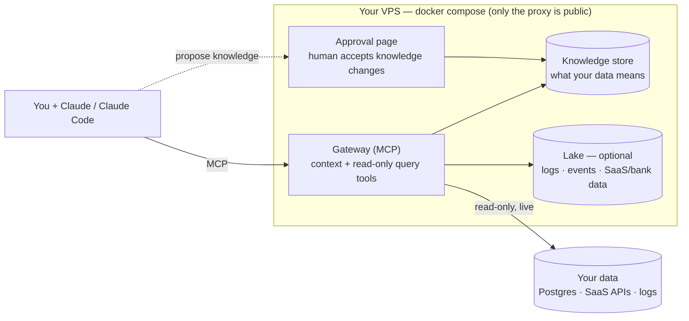

# Setoku

**Setoku is institutional memory for AI agents — captured once, used by every agent and teammate, on your own server and your own Claude subscription.**

- **The problem.** What your data *means* lives in people's heads: which metric is the real one, why "paying customer" is trickier than it looks, the gotchas that make an obvious query wrong. People leave and it walks out the door — and AI agents never had it, so they guess and are confidently wrong.
- **What Setoku does.** It remembers — definitions, the canonical query for each metric, the gotchas — and hands that to your AI *right before it answers*, so it computes things the way your business actually does.
- **It's safe to point at production.** The agent only runs read-only, audited queries, and it can't change what the company "knows" — a human approves every addition to the memory, outside the agent's loop. Prompt injection can't poison it.
- **It runs on your box.** Ships tools, not models — no AI runs on the server, so there are no AI keys and no per-query cost. Just one small VPS plus the Claude seats you already have.

Today Setoku is deep on **data** (what your tables and metrics mean). The same memory naturally holds more — personal context, house design conventions — see [docs/memory.md](./docs/memory.md).

_Setoku = **set** (math) × **oku** (奥, innermost): the innermost layer underneath your AI. (Naming: [NAMES.md](./NAMES.md). Full design history: [SPEC.md](./SPEC.md).)_

> **Status:** working prototype. One box serves a live pilot today — querying its Postgres read-only, ingesting its logs, Slack, and bank data, and answering questions through Claude.

---

## What it is

Setoku is a small self-hosted server that sits between your AI (Claude) and your data. It does two things:

1. **Holds curated knowledge about your data** — what your tables and metrics actually mean, the canonical SQL for each metric, and the gotchas that make naive queries wrong (e.g. "active user" excludes internal test accounts; refunds must be subtracted from revenue; a status column is current-state only, so you count events from the log table instead).
2. **Gives the agent a governed way to query** — read-only, with a row cap, a statement timeout, a table allow-list, and an append-only audit log of who ran what.

The agent looks up the context first, then runs the query — so it answers the way your business actually computes things instead of guessing from column names.

It ships **tools, not models**. No AI runs on the server; all the reasoning happens in your Claude. That means no AI API keys and no per-query AI cost — a whole deployment is one small VPS plus the Claude seats your team already has.

## Why we built it

- **Agents are good at SQL but don't know *your* business.** They guess what a column means and get it subtly, confidently wrong. Setoku stores those rules once, verified by a human, and feeds them to every query.
- **Your data is scattered.** Even a tiny company's data lives across a database, request logs, Slack, a bank, a codebase. Setoku hooks each source up and gives the agent one place to reach them.
- **Pointing an agent at production data is risky.** Prompt injection is real — an agent reading a Slack message could be talked into doing something. Setoku makes it safe: queries are read-only and enforced by the database engine itself, and the agent can never change what it *knows*. Every change to the knowledge is approved by a human, outside the agent's loop.

## How to deploy it

One command on a fresh Ubuntu VPS (~$12/mo):

```bash
git clone https://github.com/Hedgy-Labs/setoku /opt/setoku && cd /opt/setoku
SETOKU_ADMIN_USER=you ./deploy/bootstrap.sh
```

It installs Docker, generates secrets, gets a real HTTPS certificate (uses `<your-ip>.sslip.io` if you don't have a domain yet), and brings the whole stack up. It prints the command to connect Claude and the token for log drains. (`SETOKU_ADMIN_USER` is the `/admin` login it creates; set it so the script runs unattended — omit it and it asks once, interactively.)

Then point Claude at the box and run `/setoku:onboard` in a business repo — it wires up your database (the credential stays in your env; only the env-var *name* goes in config) and generates the first knowledge from your code.

The point isn't that Claude can query your Postgres — if you're an engineer, it already can. The point is that the *meaning* gets captured once and **shared with the whole team**: `add-teammate` mints a connector for anyone, and a non-technical teammate can then query and visualize their own data in plain language on claude.ai ("show me signups by week") — and get the *right* number, because your annotations ride along.

## High level architecture

Everything is one `docker compose` on one VPS. Only the web proxy faces the internet; the databases are never exposed.



**Two pieces:**

1. **A provisioner** that hooks each data source up on demand — query a Postgres live (read-only), ingest logs and events, pull an API on a schedule, archive Slack. You maintain a handful of proven patterns, not one connector per vendor.
2. **A gateway** that gives agents two kinds of tools over MCP: *context* tools (look up what the data means) and *data* tools (`get_schema`, `run_query` — read-only, audited, routed to whichever store the data lives in).

**The membrane — what makes it injection-safe.** Agents can only *propose* knowledge; a human accepts it on the approval page, outside the agent loop. The deployed gateway holds no tool that commits curated knowledge. So an agent tricked by a malicious log line can propose nonsense, but nothing takes effect without a human click.

**What runs in the box:**

| Component | Role |
|---|---|
| **Caddy** | HTTPS edge — the only public-facing container |
| **Gateway** | the MCP server (context + query tools) and the `/admin` approval surface |
| **Postgres** | the knowledge store and admin accounts |
| **ClickHouse + Vector** *(optional)* | a lake for logs/events/telemetry — only when there's more than Postgres should hold |

Your operational data stays where it is — Setoku queries Postgres **live and read-only**; it doesn't copy your database. Read-only is enforced by the database engine (a SELECT-only role), not by parsing SQL in our code.

---

Apache-2.0 ([LICENSE](./LICENSE)). Contributing: [CONTRIBUTING.md](./CONTRIBUTING.md) (DCO sign-off). Security & token posture: [SECURITY.md](./SECURITY.md). Design & roadmap: [SPEC.md](./SPEC.md). The safety invariants the code preserves (I1–I9): [docs/invariants.md](./docs/invariants.md).
