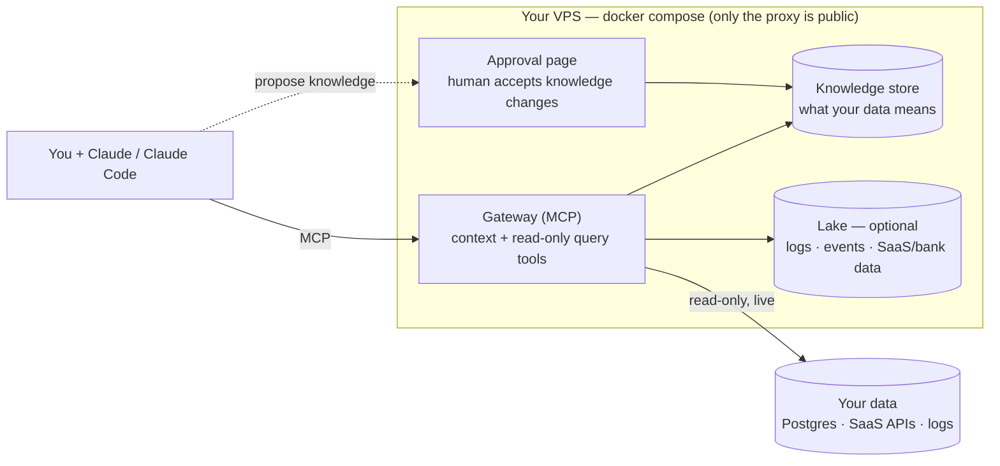

# Setoku

**AI is good at writing queries. It just doesn't know what your data means — so it guesses, and it's confidently wrong.**

Setoku fixes that. It remembers what your data means and hands that to your AI right before it answers — so the AI counts things the way your business actually counts them.

- **The problem.** What your data *means* lives in people's heads. Which number is the real "revenue." Why "paying customer" is trickier than it sounds. The small gotchas that turn an obvious query into a wrong answer. When people leave, that knowledge walks out the door — and the AI never had it in the first place.
- **What Setoku does.** It writes that knowledge down once — the definitions, the right query for each number, the gotchas — and feeds it to your AI the moment it's needed. So the AI answers the way your business works, not the way it guesses from column names.
- **It's safe to point at your real data.** The AI can only read, never change. Every query it runs is logged. And it can't edit what the company "knows" — a person approves every new fact by hand. So a poisoned Slack message can't trick it into corrupting your knowledge.
- **It runs on the Claude subscription you already pay for.** All the thinking happens inside your own Claude. Setoku ships the tools and the knowledge, never the AI itself. No API keys, no bill per question — just one cheap server plus the Claude seats your team already has.

Right now Setoku is deepest on **data** — what your tables and numbers mean. The same memory can hold more over time (team conventions, how you like things done): see [docs/memory.md](./docs/memory.md).

_Setoku = **set** (math) × **oku** (奥, innermost): the innermost layer underneath your AI. (Naming: [NAMES.md](./NAMES.md). Full design history: [SPEC.md](./SPEC.md).)_

> **Status:** working prototype. One box is live today — reading a real Postgres, pulling in its logs, Slack, and bank data, and answering questions through Claude.

---

## What it is

Setoku is a small server you run yourself. It sits between your AI and your data and does two things:

1. **It remembers what your data means** — what each table and number actually is, the right query for each one, and the gotchas that make the obvious query wrong. (For example: "active user" leaves out your own test accounts. Revenue has to subtract refunds. A "status" column only tells you today's state, so to count what happened you read the log instead.)
2. **It gives the AI a safe way to look at the data** — read-only, capped in size, cut off if a query runs too long, limited to approved tables, with a log of every query run.

The AI looks up the meaning first, then runs the query. So it answers the way your business actually works, instead of guessing from names.

Setoku ships tools, not AI. No AI runs on the server — all the thinking happens in your Claude. That means no API keys and no cost per question. A whole setup is one cheap server plus the Claude seats you already pay for.

## Why we built it

- **AI is great at SQL but doesn't know your business.** It guesses what a column means and gets it subtly, confidently wrong. Setoku writes the rules down once, checked by a person, and feeds them to every query.
- **Your data is scattered.** Even a tiny company keeps data in a database, its logs, Slack, a bank, its code. Setoku connects each one and gives the AI a single place to reach them all.
- **Pointing AI at real data is scary.** A message hidden in your data could try to trick the AI. Setoku makes it safe: the AI can only read, and it can never change what the company knows. A person approves every new fact by hand.
- **We're too small to pay per token — and so are you.** The hosted versions of this charge you by the token, on top of your AI bill. We didn't want that bill ourselves, so we didn't build it that way. Setoku runs on the Claude subscription you already have. One cheap server, your existing seats, nothing extra per question.

## How to deploy it

One command on a fresh Ubuntu VPS (~$12/mo):

```bash
git clone https://github.com/Hedgy-Labs/setoku /opt/setoku && cd /opt/setoku
./deploy/bootstrap.sh
```

It installs Docker, generates secrets, gets a real HTTPS certificate (uses `<your-ip>.sslip.io` if you don't have a domain yet), and brings the whole stack up. It prints the command to connect Claude and the token for log drains.

Then point Claude at the box and run `/setoku:onboard` in a business repo — it wires up your database (the credential stays in your env; only the env-var *name* goes in config), checks the connection, and writes the first knowledge from your code.

> Prefer not to run a server? Install the Claude Code plugin and run `/setoku:onboard` against an existing Postgres — fully local, no box needed.
> ```bash
> claude plugin marketplace add Hedgy-Labs/setoku && claude plugin install setoku@setoku
> ```

## High level architecture

Everything is one `docker compose` on one VPS. Only the web proxy faces the internet; the databases are never exposed.



**Two pieces:**

1. **A provisioner** that hooks each data source up on demand — query a Postgres live (read-only), pull in logs and events, fetch an API on a schedule, archive Slack. You keep a few proven patterns instead of one connector per vendor.
2. **A gateway** that hands the AI two kinds of tools over MCP: *context* tools (look up what the data means) and *data* tools (`get_schema`, `run_query` — read-only, logged, pointed at wherever the data lives).

**Why a poisoned message can't hurt you.** The AI can only *suggest* new knowledge. A person approves it on a web page, outside the AI's reach. The running server has no tool that can save knowledge on its own. So if a malicious log line tricks the AI, the worst it can do is suggest nonsense — and nothing sticks until a human clicks approve.

**What runs in the box:**

| Component | Role |
|---|---|
| **Caddy** | HTTPS edge — the only public-facing container |
| **Gateway** | the MCP server (context + query tools) and the `/admin` approval surface |
| **Postgres** | the knowledge store and admin accounts |
| **ClickHouse + Vector** *(optional)* | a lake for logs/events/telemetry — only when there's more than Postgres should hold |

Your data stays where it is — Setoku reads your Postgres **live and read-only**; it doesn't copy your database. Read-only is enforced by the database itself (a read-only role), not by trying to check the SQL in our code.

---

Apache-2.0 ([LICENSE](./LICENSE)). Contributing: [CONTRIBUTING.md](./CONTRIBUTING.md) (DCO sign-off). Security & token posture: [SECURITY.md](./SECURITY.md). Design & roadmap: [SPEC.md](./SPEC.md). The safety invariants the code preserves (I1–I9): [docs/invariants.md](./docs/invariants.md).
