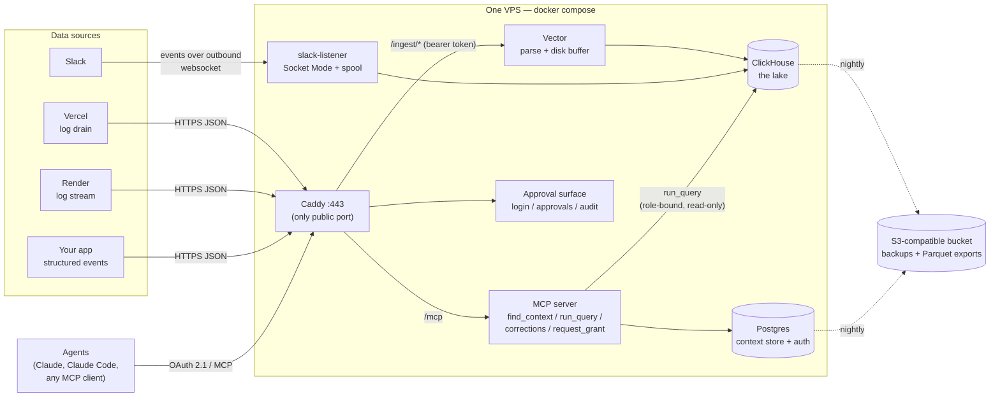
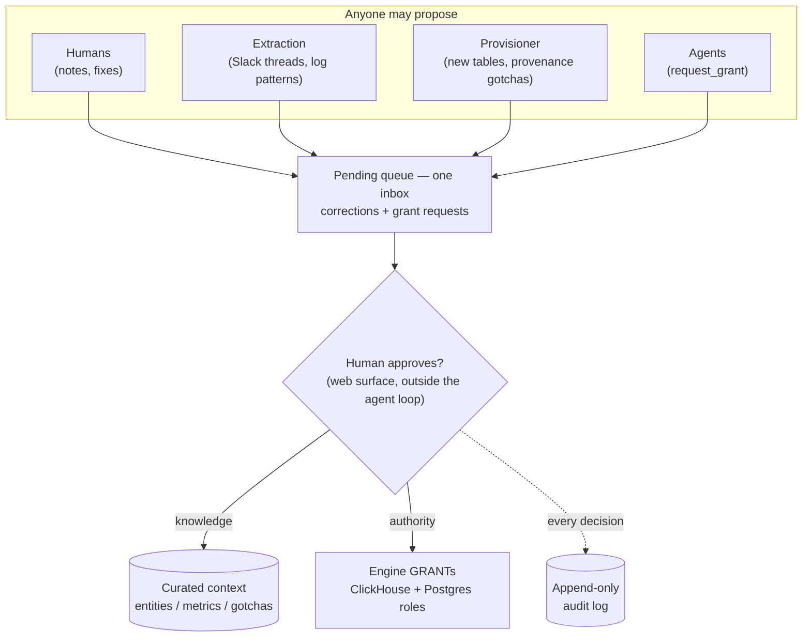
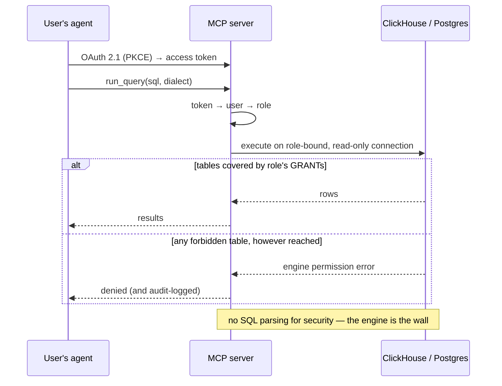

# Setoku

**An open-source context layer + self-provisioning data lake for AI-assisted analytics.**

Setoku stores curated knowledge *about* a business's data — entities, canonical metric
definitions, known-good queries, and gotchas — and exposes it to AI agents over MCP.
Unlike warehouse-overlay semantic layers, Setoku also **bundles its own lake**
(ClickHouse) and can **hook itself up**: hand it API tokens and it discovers your data
sources, provisions log drains, infers schemas, creates tables, and — critically —
**writes its own context docs as it provisions**, so every table arrives pre-documented.

Knowledge enters the context layer through a single membrane: the **corrections queue**.
Humans, extraction pipelines, and the provisioner itself all propose; a human curates.

**All intelligence lives in the user's agent.** Setoku ships *tools* (over MCP), not
models: it holds no AI API keys, performs no server-side inference, and adds zero
marginal AI cost. An org's whole deployment is one small VPS plus the AI
subscriptions its people already have.

_Setoku = **set** (math) × **oku** (奥, innermost): the innermost set — the
intelligence layer underneath your AI._ (Naming saga: [NAMES.md](./NAMES.md).)

> **Status:** prototype. Current deploy serves Hedgy (a recruiting marketplace) as the
> pilot tenant. This README doubles as the work plan — see TODOs below.

---

## What exists today (v0.9)

The current prototype is a **Claude Code plugin + MCP gateway** (TypeScript, Bun) —
the embryo of `server/` in the target layout below. See [SPEC.md](./SPEC.md) for its
full design and changelog, and [PRESSURE_TEST.md](./PRESSURE_TEST.md) for
answer-quality evidence (clean-room A/B on the pilot).

```
You ⇄ Claude Code  ──skills──▶  setoku MCP gateway  ──▶  knowledge store    (verified business context; corrections lifecycle, revisions)
        (your seat)                 (this plugin)    ──▶  your Postgres      (read-only, row-capped, audited)
```

- **Context tools** — `find_context`, `list_entities`, `describe_entity`,
  `get_metric`, plus the corrections membrane: `report_correction`,
  `upsert_context`, `list_corrections`, `resolve_correction`.
- **Data tools** — `get_schema`, `run_query`: live Postgres through a choke point —
  READ ONLY transactions, statement timeout, row cap, table allow-list, JSONL audit
  log with user attribution.
- **Skills** — `/setoku:onboard` (setup interview), `/setoku:generate` (derive the
  context artifact from your code, `file:line`-grounded), `/setoku:analyst` (retrieve
  context → canonical SQL → answer), `/setoku:curate`, `/setoku:eval`
  (golden-question scorecard).
- **Transports** — stdio (the plugin) and HTTP with per-user bearer tokens
  (`deploy/`); token-in-URL-path supported for the Cowork custom-connector dialog.

### Install (current plugin)

Requires [Bun](https://bun.sh) and Claude Code.

```bash
claude plugin marketplace add Hedgy-Labs/setoku
claude plugin install setoku@setoku
```

Then, in any business repo, run `/setoku:onboard`. It writes `.setoku/config.json`
(your DB credential stays in your env — only the _env var name_ goes in config),
verifies connectivity, offers to generate the context artifact from your code, and
runs your first question end-to-end. Commit `.setoku/` — config and context are
shared with your team via git (audit logs are auto-gitignored).

### Development

```bash
bun install
bun run typecheck
bun test          # needs a local Postgres; uses unix socket at /tmp by default
                  # override: SETOKU_E2E_PG_HOST, SETOKU_E2E_DB_URL, SETOKU_E2E_PG_MAINTENANCE_DB
```

The e2e suite creates a `setoku_e2e` database with a synthetic shop schema
(deliberate gotchas: soft deletes, refunds, integer cents), spawns the exact server
the plugin ships over stdio, and drives it with a real MCP client: tool surface,
allow-list scoping, read-only enforcement (including CTE-smuggled writes), row caps,
timeouts, retrieval quality, corrections, and audit attribution.

---

## Architecture (decided — do not relitigate without a written reason)

**Figure 1 — the whole system.** Everything inside the box is one `docker compose up`
on one small VPS (prototype: Oracle's free 24 GB ARM box; recommended for users:
~€8/mo Hetzner). Only Caddy faces the internet; all intelligence lives in the
connecting agents (I8).



| Layer | Choice | Why |
|---|---|---|
| Context store | **Postgres** (`tsvector` FTS + trigram; pgvector optional) | Scales with *schema complexity*, not data volume — thousands of docs at worst, forever. Boring, transactional, concurrent-writer-safe. Retrieval defaults to FTS (zero inference, no keys — see I8); embeddings are an opt-in upgrade. |
| Lake / event store | **ClickHouse, single node** (Apache 2.0, self-hosted) | Live ingest (events queryable on insert), columnar aggregation, eats billions of rows on one box. The enterprise endgame engine — prototype on the real target. |
| Log/event pipeline | **Vector** (vector.dev, MPL-2.0) in *receiver* mode | First-class ClickHouse sink, disk buffering when sink is down, replaces a hand-rolled ingest service. Sources push to it (see below); it does not tail files. |
| Archive / portability | **Parquet on S3-compatible object storage** | ClickHouse reads/writes it natively; ad-hoc/offline analysis needs no extra engine (`clickhouse-local`, or anything that reads Parquet — DuckDB, pandas, Spark — at the user's option). Migration path (bigger node → ClickHouse Cloud) never strands data. |
| Edge / TLS | **Caddy** | Auto-HTTPS in ~4 lines; the only public-facing container. |
| Deployment | **Single VPS, docker-compose.** Prototype: **Oracle Cloud Always Free** A1 (4 ARM OCPU / 24 GB / 200 GB, $0 — PAYG-converted, see Phase 2). Recommended path for users: Hetzner-class VPS (~€8/mo CX32). | One box, one bill (or none). Everything on localhost; databases never exposed. The compose file *is* the product's body and reference deployment. Whole stack is arm64-clean. |

**Explicitly rejected:** SurrealDB (BSL license, wrong engine for event volume);
Fly.io for the consolidated box (RAM ~5x Hetzner's price, one-container-per-machine
fights the compose model); Render for hosting (~$27/mo for 2 GB, no colocation
benefit); Railway for hosting (usage-metered RAM ≈ $10/GB/mo — the wrong price
model for an always-on database; fine if a *user* chooses it, wrong as the
reference); DuckDB anywhere in the stack (single-writer rules it out as the serving
lake, and ClickHouse already covers Parquet querying — it remains merely one of
several tools a user may point at the Parquet exports; not a dependency).

**Data sources (initial three — resist the connector matrix):**

1. **Vercel** → Log Drains POST JSON/NDJSON batches over HTTPS to our endpoint.
   ⚠ Requires Vercel **Pro** plan; drains are creatable via Vercel API (self-provisioning hook).
2. **Render** → Log Streams forward as HTTPS JSON (preferred) or RFC5424 syslog/TLS,
   configured at workspace level. ⚠ Render drops lines beyond ~6,000/min/instance;
   retention is plan-limited — streaming out is the durable copy.
   Bandwidth is a non-issue: even logging at the 6k cap nonstop is ~78 GB/mo
   (~300 B/line) against a 100 GB workspace allowance with $0.15/GB overage;
   realistic worker volume is a tenth of that. (Confirm with Render whether
   log-stream forwarding counts against the allowance at all.) The drop ceiling,
   not cost, is the real limit — route high-volume telemetry as first-party
   structured events (below), which bypass Render's log pipeline entirely.
3. **Slack** → **Socket Mode listener** (Events API, `message` events) for live capture;
   `conversations.history` for one-time backfill only.
   ⚠ Free-plan workspaces: only ~90 days of history is retrievable — **start the
   listener before anything else ships; the archive only accrues forward.**
   ⚠ Rate-limit landscape (verify against current Slack docs at build time):
   *internal customer-built apps* keep generous limits (~50 req/min, 1000 objects);
   *commercially distributed non-Marketplace apps* are capped at ~1 req/min, 15
   objects (enforcement extended to existing installs in 2026). The OSS self-host
   model means every org runs its own **internal** app → we stay on the generous tier.
   A future hosted SaaS would need Marketplace approval. Document this in the README
   section on Slack setup.

Plus a **first-party structured events endpoint**: applications POST deliberate events
(e.g. `pairing_created`, `fee_acknowledged`) to the same Vector pipe. This is the
high-grade ore; platform request logs are the low-grade ore. Both land in the lake;
knowledge distills to context via the corrections queue.

**Two-layer rule (per-insight, not per-source):** every source's raw rows go to the
lake. Knowledge extracted from any source — stated in Slack prose, or inferred from
log patterns — flows to the context layer **only** through the corrections queue.

### The membrane, on a whiteboard

**Figure 2.** The same sentence twice: knowledge enters curated context only through
human approval (I2), and authority changes only through human approval (I9). One
pattern, two applications, one inbox. This is the structural answer to "what stops
the agent from doing something it shouldn't" — agents reading untrusted text (logs,
Slack) can be prompt-injected into *proposing* anything, but nothing they propose
takes effect without a human click outside the agent loop.



*The one labeled exception (I2): the provisioner's initial entity docs may
auto-accept, attributed `setoku-provisioner`, with full revision history — they
describe tables it just created, so there is nothing for a human to dispute yet.*

---

## Repo layout (target)

```
setoku/
├── README.md                  ← this file
├── LICENSE                    ← Apache-2.0 (see Phase 1)
├── NOTICE
├── docker-compose.yml         ← the whole system; profiles: core / lake / ingest
├── .env.example
├── Caddyfile
├── deploy/
│   ├── hetzner.md             ← provisioning + hardening runbook
│   ├── backup/                ← clickhouse-backup config, pg_dump cron, restore drill
│   └── vector/                ← generated + template Vector configs
├── server/                    ← MCP server (find_context, run_query, corrections, …)
├── provisioner/               ← "hooks itself up" engine (Phase 4)
├── ingest/
│   ├── slack-listener/        ← Socket Mode daemon
│   └── schemas/               ← ClickHouse DDL (hand-written + inferred)
├── seed/                      ← fictional example business: docs, events, logs
└── docs/
```

*How today's code maps in: `plugin/gateway/` is the embryo of `server/` (the plugin
packaging in `plugin/` remains the Claude Code distribution channel);
`test/` stays; `deploy/` grows the runbooks. The v0.9 knowledge store is
gateway-owned SQLite — it migrates to the Postgres context store in the table
above as part of the Phase 2/5 build-out.*

---

## Invariants (the agent must preserve these)

- **I1 — Databases are never public.** Only Caddy binds a public port (443; SSH on the
  host). Postgres and ClickHouse listen on the compose network only.
- **I2 — The corrections queue is the only write path into curated context.**
  Provisioner and extractors *propose* (status: pending); humans *accept*.
  Exception: provisioner-generated initial entity docs may be auto-accepted but must
  be attributed `author: setoku-provisioner` and carry a revision history like any doc.
- **I3 — No pilot-tenant data in the repo.** Nothing from Hedgy — no real metric
  definitions, gotchas, channel names, or log samples — appears in code, fixtures,
  tests, seeds, or docs. CI greps for a denylist (see task 0.3 / Phase 6 red-team pass).
- **I4 — Lake data is now durable user data.** Bundling the lake means Setoku may hold
  the *only* copy of a user's logs. Backups to object storage are part of setup, not a
  footnote. Vector buffers to disk so a ClickHouse restart drops nothing.
- **I5 — Engine-portable knowledge.** Context docs are markdown + SQL. SQL in metric
  docs declares its dialect (`clickhouse` | `postgres`). `run_query` routes by dialect.
- **I6 — Single-tenant by architecture.** One deploy = one org. No tenancy layer.
  Market it as an isolation feature.
- **I7 — Verify vendor facts at build time.** Slack rate limits, Vercel/Render plan
  gating, and prices in this document were checked June 2026 and churn frequently.
  Re-verify against official docs before encoding behavior around them.
- **I8 — No server-side inference; zero AI keys required.** Setoku never calls an
  LLM or embedding API. All reasoning happens in the connecting agent. `find_context`
  must work fully on Postgres FTS + trigram alone. Optional upgrades, strictly
  opt-in and clearly labeled: (a) a bundled local CPU embedding model (MiniLM-class
  ONNX) running on the box at no cost and with no keys, then (b) bring-your-own-key
  embedding provider. The default deploy must function with no AI credentials of
  any kind.
- **I9 — Authority changes pass through a human, outside the agent loop.** The lake
  is full of untrusted text (logs, Slack, customer events); an agent reading it is
  prompt-injectable. Therefore no MCP tool may directly create users, change roles,
  or grant data access. Agents *propose* (pending grant requests — same membrane
  pattern as I2); a human *approves* on the web approval surface. Table/source
  access is enforced by the database engines themselves (per-role DB users +
  GRANTs), never by SQL parsing in our code. `find_context` results are filtered by
  the same grants as the tables the docs describe.

## Requires a human (the agent should stop and ask)

- Purchasing the Hetzner server & object storage; DNS records; SSH keys.
- Vercel token (Pro plan confirmation), Render API key, Slack app creation/approval
  in the workspace (manifest can be generated, but install is a human click).
- The relicensing decision is made (Apache 2.0) but a human signs off on the commit,
  confirms all existing code is theirs to relicense, and re-reads the license text.
  *(Nothing here is legal advice.)*
- Accepting any correction into curated context.

---

# TODO — phased handoff plan

Phases are ordered by dependency. Within a phase, tasks are roughly parallel.
Each task lists acceptance criteria (**AC**). Check items off in PRs.

## Phase 0 — Repo groundwork

- [ ] **0.1 Extract the engine from the Hedgy deploy.** Split current code into
  `server/` (generic) and a private overlay holding Hedgy's context docs and creds.
  **AC:** fresh clone runs with zero Hedgy references; existing Hedgy deploy still
  works using the overlay.
  *Status 2026-06-11: the public repo is already generic — fixtures are a synthetic
  shop; Hedgy's context docs + creds live outside the repo (`hedgy/.setoku/`,
  baked in at deploy time per `deploy/README.md`). Remaining: verify the AC on a
  fresh clone and confirm the pilot deploy against the overlay.*
- [ ] **0.2 Build the seed dataset.** Invent a small fictional business (e.g. a plant
  e-commerce shop): ~6 entities, ~6 metrics, ~10 gotchas, a few thousand fake events
  and log lines, sample Slack-style messages. Make the gotchas *teach the concept*
  (e.g. a field whose name lies, a logging outage, a bot UA polluting sessions).
  **AC:** `docker compose --profile seed up` produces a fully explorable demo;
  `find_context` returns sensible results against it.
- [ ] **0.3 CI skeleton.** Lint, tests, compose config validation, and the I3 denylist
  grep (maintain the actual list in the private overlay, not the public repo).
  **AC:** CI green on a PR; a planted Hedgy-term fixture fails CI.
  *Status 2026-06-11: `.github/workflows/ci.yml` landed — typecheck + e2e against a
  Postgres service, SPDX-header check, dependency-license audit, denylist grep
  (`scripts/check-denylist.sh`, terms via the `SETOKU_DENYLIST` repo secret from the
  private overlay), DCO check on PRs, compose validation auto-activates when
  `docker-compose.yml` exists. Planted-term failure verified locally; remaining:
  set the secret and watch a real PR go green.*

## Phase 1 — Relicense to Apache 2.0

Rationale (from design discussion): explicit per-contributor patent grant +
retaliation clause; the convention for database-adjacent infrastructure (ClickHouse,
Kafka, Kubernetes ecosystem); pre-answers enterprise legal's patent question. All
bundled dependencies are compatible (ClickHouse Apache-2.0, Postgres license,
Vector MPL-2.0 — file-level copyleft, untouched since we only generate configs
and pull official images).

- [x] **1.1** Replace `LICENSE` with the verbatim Apache-2.0 text; add `NOTICE`
  (project name, copyright line, attribution for any Apache-2.0 artifacts we
  redistribute). **AC:** `licensee` (or equivalent) detects Apache-2.0.
- [x] **1.2** Add SPDX headers (`Apache-2.0`) to source files; add license metadata to
  package manifests. **AC:** spot-check + CI check passes.
- [x] **1.3** Adopt **DCO** (Developer Certificate of Origin): `CONTRIBUTING.md`
  explains sign-off; CI enforces `Signed-off-by`. This preserves the option to
  relicense future versions if a hosted product ever needs it. **AC:** unsigned PR
  fails the DCO check.
- [x] **1.4** Dependency license audit in CI (fail on GPL/AGPL/unknown in the
  *bundled/distributed* dependency set). **AC:** report artifact in CI; build fails on
  a planted AGPL dep.
- [x] **1.5** ⛔ *Human:* confirm sole copyright over all existing code (or collect
  consents) before merging the relicense commit.

*Status 2026-06-11: **Phase 1 complete.** Verbatim `LICENSE` (byte-identical to
apache.org canonical text) + `NOTICE`; SPDX headers on all TS sources + manifest
`license` fields (CI-enforced via `scripts/check-spdx.sh`); `CONTRIBUTING.md`
with DCO + CI sign-off check; dependency audit (`scripts/check-licenses.ts`)
fails on GPL/AGPL anywhere and unknown licenses in the bundled set, report
uploaded as a CI artifact — planted AGPL and unknown-license failures verified.
1.5 human sign-off given 2026-06-11 (sole author per git history).*

## Phase 2 — Single-box deployment (Oracle Always Free)

Prototype target: **Oracle Cloud `VM.Standard.A1.Flex`, 4 OCPU / 24 GB / ~150 GB
boot+data, $0/mo** (always-free allowance; ARM Ampere — the whole stack is arm64).
Non-negotiable discipline before anything else: **convert the tenancy to
Pay-As-You-Go** (fixes the A1 capacity lottery and exempts the instance from
idle-reclamation; expect a temporary card-verification hold), set a **~$1 budget
alert**, and keep the backup bucket **on a different provider** (I4 makes the box
disposable). Pick the home region deliberately — always-free A1 provisions only
there (us-sanjose-1 or us-phoenix-1 are sensible from LA; PAYG largely removes the
capacity problem regardless). The recommended *user* path stays a Hetzner-class
VPS (~€8/mo CX32) — reference infra must not depend on a free tier's goodwill —
so the runbook ships in both flavors (2.1/2.1b).

- [ ] **2.1 Provisioning runbook + script — Oracle Always Free**
  (`deploy/oracle-free.md`, the prototype path): ⛔ *human first*: tenancy signup,
  home-region choice, **PAYG conversion**, ~$1 budget alert. Then: A1.Flex
  4 OCPU / 24 GB, Ubuntu LTS arm64, docker + compose plugin, non-root deploy user;
  firewall **both** in OCI Security Lists (open only 22/443 — OCI's default NSG is
  the real perimeter) **and** on-host `ufw` (open only 22/443); `fail2ban`,
  `unattended-upgrades`. Reserved public IP so the box can be rebuilt without DNS
  churn. State the discipline bluntly in the doc: backup bucket on a *different*
  provider; treat the box as disposable (I4 makes this true).
  **AC:** fresh tenancy → running stack in under 30 minutes following the doc
  alone (post-signup); external port scan shows only 22/443.
- [ ] **2.1b Recommended-path doc — Hetzner** (`deploy/hetzner.md`): same runbook
  shape for a CX32-class VPS (~€8/mo), x86 or ARM. This is the *recommended* user
  path in public docs — reference infra should not depend on a free tier's
  goodwill — even though the prototype runs on 2.1.
  **AC:** stack verified on a Hetzner box once; doc parity with 2.1.
- [ ] **2.2 docker-compose.yml** with profiles:
  - `core`: `postgres` (16+; `pgvector` installed but unused by default — see I8), `server` (MCP), `caddy`
  - `lake`: `clickhouse` (pin a current LTS image)
  All images pinned multi-arch (manifest-list digests) — prototype is arm64,
  recommended path may be x86.
  - `ingest`: `vector`, `slack-listener`
  Named volumes for all data dirs. Healthchecks on every service;
  `depends_on: condition: service_healthy`. `restart: unless-stopped`.
  **AC:** `docker compose up -d` on the prototype box brings everything healthy;
  `docker compose down && up` loses no data.
- [ ] **2.3 ClickHouse config:** ship two presets — `small` (4–8 GB boxes:
  `max_server_memory_usage_to_ram_ratio: 0.7`, background pools 2–4, modest
  mark-cache, low `max_concurrent_queries`) and `roomy` (the 24 GB prototype:
  same ratio, defaults otherwise). The only client is `run_query` + Vector
  inserts either way. Listen on compose network only (I1).
  **AC:** seed-scale ingest + queries run with zero OOM kills over a 24 h soak
  on the `small` preset (the constraining case).
- [ ] **2.4 Caddy:** terminate TLS for `setoku.<domain>`; route `/mcp` → server,
  `/ingest/*` → Vector HTTP source. Auth: bearer token on `/ingest/*` (Vercel and
  Render both support sending a token/custom header — verify exact mechanism per I7).
  **AC:** valid-token POST lands in ClickHouse; tokenless POST → 401; ports 5432/8123
  unreachable from the internet (scan to prove).
- [ ] **2.5 Backups (I4):**
  - `clickhouse-backup` → S3-compatible object storage **on a different provider
    than the box** (B2 / R2 / Hetzner object storage), nightly, 14-day retention.
  - `pg_dump` of the context store, nightly, to the same bucket. **The context store
    is the irreplaceable asset** — it is curated human knowledge, not rebuildable.
  - Weekly Parquet export of lake tables to the bucket (the portability guarantee:
    a standard open format any engine can read — document this in the export docs).
  - A **restore drill** script + doc; run it once for real.
  **AC:** `deploy/backup/restore-drill.sh` rebuilds a working stack on a clean VM from
  bucket contents alone; data gap bounded to <24 h.
- [ ] **2.6 Minimal monitoring:** uptime ping on `/healthz` (aggregate health incl.
  disk %, queue depths), Vector internal metrics logged, alert email/webhook on
  failure. Disk-full is the #1 predictable incident — alert at 75 %.
  **AC:** killing ClickHouse triggers an alert within 5 min; Vector buffers during the
  outage and drains after restart with zero loss (test this exact sequence).

## Phase 3 — Ingestion pipelines (manual wiring first)

Build the pipes by hand before teaching Setoku to build them (Phase 4 automates
exactly these steps — write each as a reusable function, not a one-off).

- [ ] **3.1 Vector receiver config:** one `http_server` source behind Caddy;
  transforms parsing (a) Vercel drain NDJSON, (b) Render HTTPS-JSON log streams,
  (c) first-party structured events; disk buffers (`when_full: block` for events,
  `drop_newest` acceptable for request logs); ClickHouse sinks with batching.
  **AC:** golden-file tests for each transform; replayed fixtures appear correctly
  typed in ClickHouse.
- [ ] **3.2 ClickHouse schemas** (`ingest/schemas/`): `logs_vercel`, `logs_render`,
  `app_events`, `slack_messages` — MergeTree, `ORDER BY` (source/channel, timestamp),
  `PARTITION BY toYYYYMM(timestamp)`, TTL configurable per table. Document every
  column (these comments become provisioner-generated context docs in Phase 4).
  **AC:** DDL applies idempotently; seed queries (p95 latency by route, messages per
  channel per week) return correct results.
- [ ] **3.3 Slack Socket Mode listener:** small daemon; app manifest checked into
  repo (`channels:history`, `channels:read`, users read scope; Socket Mode on).
  Handles reconnects; spools to local disk when ClickHouse is unavailable (I4);
  inserts message, thread_ts, channel, user, ts. **Start it in production as soon as
  it works** — the 90-day free-plan window is burning.
  **AC:** survives a ClickHouse restart with zero message loss; a posted test message
  is queryable within seconds.
- [ ] **3.4 Slack backfill:** one-shot job paginating `conversations.history` +
  `conversations.replies` over the retrievable window, resumable, respecting
  rate-limit headers (`Retry-After` on 429), with tier auto-detection (if responses
  cap at 15 objects, drop the request budget to 1/min — see I7).
  **AC:** idempotent re-runs (no dupes — dedupe on channel+ts); completes on the
  pilot workspace.
- [ ] **3.5 First-party events endpoint:** document a tiny JSON contract
  (`event_name`, `ts`, `actor`, `properties{}`); provide a 20-line client snippet.
  **AC:** seed app posts events end-to-end into `app_events`.
- [ ] **3.6 `run_query` dialect routing (I5):** context-store SQL marked
  `clickhouse` executes against the lake; `postgres` against a configured business
  DB (the existing Hedgy mode). Read-only enforced both paths (CH: readonly user;
  PG: read-only transaction + statement timeout, as today).
  **AC:** metric docs of both dialects execute; mutation attempts are rejected.

## Phase 4 — Self-provisioning ("hooks itself up") — the differentiator

Flow: user supplies tokens → Setoku discovers → provisions → infers → creates →
**documents itself**. Ship as both CLI (`setoku init`) and an MCP tool so an agent
can drive it conversationally.

- [ ] **4.1 Provisioner framework:** `SourceProvisioner` interface —
  `discover() → plan() → apply() → document()`. **Plan/apply split is mandatory:**
  print exactly what will be created (drains, apps, tables, configs) and require
  confirmation; `--dry-run` everywhere. Idempotent `apply` (safe re-runs). Every
  action logged to a `provisioning_log` table (the audit trail; OSS audiences will
  read this code first — keep it boringly clear).
- [ ] **4.2 Vercel provisioner:** with a scoped token, list projects, create a Log
  Drain pointed at `https://<host>/ingest/vercel` with the bearer token; detect
  missing Pro plan and fail with a human-readable explanation.
  **AC:** `setoku init --source vercel` on a test account → logs flowing, drain
  visible in Vercel dashboard, `teardown` removes it cleanly.
- [ ] **4.3 Render provisioner:** configure workspace log stream to
  `https://<host>/ingest/render` via API where supported; where the API doesn't
  allow it, emit precise click-by-click instructions (generated, with the exact
  URL/token pre-filled) — *guided* self-setup is an acceptable fallback, silent
  failure is not. **AC:** logs flowing on a test workspace by one path or the other.
- [ ] **4.4 Slack provisioner:** generate the app manifest (workspace-specific),
  hand the human the one-click manifest-install URL, accept the resulting tokens,
  start listener + backfill. **AC:** fresh workspace → messages in lake with ≤3
  human actions, each prompted explicitly.
- [ ] **4.5 Schema inference:** sample N events from a new/unknown source, infer
  column types (with low-cardinality and timestamp detection), emit CREATE TABLE
  for human confirmation (plan/apply). Unknown future fields land in a `raw` JSON
  column rather than being dropped. **AC:** golden tests: fixture event batches →
  expected DDL.
- [ ] **4.6 Self-documentation (the soul of the feature):** every `apply` writes
  context docs through the membrane (I2): an entity doc per created table (source,
  refresh cadence, column meanings from 3.2 comments, example queries) plus
  **provenance gotchas** — at minimum: "Vercel/Render drains drop batches when the
  receiver is down; gaps ≠ traffic dips", "Render caps ~6 k lines/min/instance",
  "Slack history before <backfill-start> is unavailable (free-plan window)".
  Auto-accepted with `author: setoku-provisioner`; everything else → pending
  corrections. **AC:** immediately after `setoku init`, `find_context("vercel logs")`
  returns a useful, accurate doc that includes the gap-gotcha.
- [ ] **4.7 Token security posture:** document minimum scopes per provider; store
  tokens encrypted at rest (or via env/secret mounts), never in context docs or
  logs; redaction filter on the provisioning log. A `SECURITY.md` section explains
  exactly what Setoku does with each token — written for the skeptical OSS reader.
  **AC:** grep of logs/DB dumps after a full `init` finds zero token material.

## Phase 5 — Multi-user auth & the approval surface

Design (decided): **AuthN** follows the MCP spec — OAuth 2.1 for remote MCP clients.
Setoku is its own authorization server by default (local accounts in the context-store
Postgres, argon2id password hashing, login/consent pages served by `server/`); an
optional upstream **OIDC** mode delegates identity to Google Workspace/Okta while
authorization stays local. The prototype's secret-URL token remains the supported
*single-user mode*. **AuthZ** maps Setoku roles to real database roles —
engine-enforced GRANTs, per I9. **Admin** is a deliberately tiny web surface (the
OAuth pages force a web surface to exist anyway): pending approvals (grants +
corrections — one inbox), users/roles, token management, audit log. Agents propose
via MCP tools; humans click approve. No dashboard ambitions.

**Figure 3 — why table access can't be bypassed.** Enforcement lives in the database
engines, not in our code (I9): `run_query` binds each session to the caller's real
DB role, so views, CTEs, and table functions all hit the same GRANT wall.



- [ ] **5.1 OAuth 2.1 AS + local accounts:** authorization-code + PKCE, dynamic
  client registration, token issuance/refresh/revocation; login + consent pages;
  `setoku admin create-user` CLI bootstrap (first admin cannot arrive via a channel
  that requires auth). **AC:** Claude.ai / Claude Code connect as a remote MCP
  connector through the full OAuth flow; revoked token fails immediately.
- [ ] **5.2 Optional upstream OIDC:** configure issuer + client creds → login page
  becomes "Sign in with <IdP>"; map IdP identity → local user record; local
  passwords disabled in this mode. **AC:** end-to-end against a test Google
  Workspace tenant.
- [ ] **5.3 Roles → engine grants:** role definitions (sources/tables) materialize
  as ClickHouse roles + Postgres roles with explicit GRANTs; `run_query` binds the
  caller's session to their DB role; provisioner (Phase 4) creates/updates grants
  for tables it makes. Default-deny for new sources until granted. **AC:** a user
  without a grant gets an *engine* permission error on direct SQL, named-table or
  sneaky (view/CTE/table-function) alike.
- [ ] **5.4 Context filtering by grant (I9):** docs carry entity/table tags;
  `find_context`, `list_entities`, `describe_entity` filter by the caller's grants.
  **AC:** a revenue-table gotcha is invisible to a user without the revenue grant.
- [ ] **5.5 Grant-request membrane:** MCP tools `request_grant` / `list_my_access`
  (propose-only, per I9); approval surface lists pending requests with diff-style
  display of what access would change; approve/reject with required reason; all of
  it in the audit log alongside provisioning actions. **AC:** agent-initiated
  request → human approval → engine grant exists; agent cannot find any tool
  sequence that changes authority without the approval step (write a test that
  tries).
- [ ] **5.6 Audit log page:** who/what/when for logins, token events, grant
  changes, provisioning actions, accepted corrections. Append-only table.
  **AC:** every mutation in 5.1–5.5 produces exactly one audit row.

## Phase 6 — OSS launch hygiene

- [ ] **6.1 Rewrite this README for the public** (the TODOs migrate to issues):
  hero pitch ("hooks itself up + documents itself"), 5-minute quickstart
  (`docker compose up` → seed demo → paste two tokens → ask a question about your
  own logs), architecture diagram, the isolation-by-architecture story (I6).
- [ ] **6.2** `CONTRIBUTING.md` (DCO, dev setup, "small PRs to core please" — keep
  relicensing optionality), `SECURITY.md` (token posture from 4.7 + report channel),
  `CODE_OF_CONDUCT.md`, issue/PR templates.
- [ ] **6.3 Versioning & releases:** semver from `0.1.0`, tagged compose +
  pinned image digests per release, CHANGELOG, upgrade notes (incl. ClickHouse
  major-version upgrade guidance).
- [ ] **6.4 Connector discipline:** docs state the supported-source policy — Vercel,
  Render, Slack, first-party events; new connectors need demonstrated pull + a
  maintainer. (Each connector is a forever maintenance tax; this conversation's
  research history — Slack limits, Render gating — is the proof.)
- [ ] **6.5 Pre-launch red-team pass:** fresh-eyes review for I1 (port scan), I3
  (data leak grep), 4.7 (token handling), I9 (escalation-path test from 5.5), restore drill re-run, and an honest
  "what breaks at 100× volume" section in the docs pointing at the migration path
  (bigger node → ClickHouse Cloud; Parquet exports mean no stranded data).

---

## Migration path (so nobody designs themselves into a corner)

Prototype (free Oracle A1 box) → paid VPS, e.g. Hetzner (compose unchanged) →
bigger box (more RAM for CH) →
ClickHouse lifts out to its own node or ClickHouse Cloud (compose service becomes a
connection string; context docs, metric SQL, and pipelines unchanged) → warehouse
adapters (BigQuery/Snowflake) as the enterprise escape hatch for customers who
already have a lake. GA4 note for the e-commerce ICP: raw event-level GA data only
exists via the native BigQuery export — that integration is an *adapter* task, never
an ingestion task.

## Open questions (decide before they decide themselves)

1. Hosted-Setoku business model? (Affects nothing now thanks to DCO discipline, but
   revisit license posture before building multi-tenant anything.)
2. Auto-accept threshold for provisioner docs — is I2's exception too permissive
   once extraction pipelines (Slack-mining → corrections) come online?
3. Lake TTLs: default retention for request logs vs app events vs Slack (storage is
   cheap; deletion-by-default is a privacy feature — pick deliberately).
