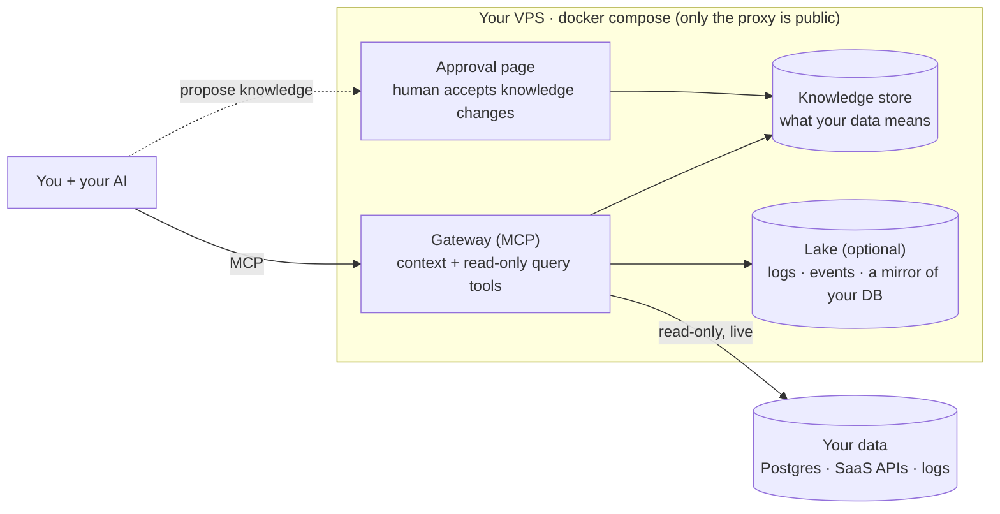

<p align="center">
  
</p>

# Setoku

**Make any AI fluent in your company's data.**

Setoku is a small self-hosted MCP knowledge server plus Claude Code skills for hooking up your data. It does two things: it gives your AI a read-only way to query your data, and it remembers what that data _means_ (the metric definitions, the gotchas), getting better the more you use it. Ask for a dashboard and publish it to a link your whole team can view, on live data. The MCP works with whatever AI you already have, and no model runs on the server, so no added inference cost.

- **The problem.** What your company knows about itself lives in people's heads: which metric is the real one, why "paying customer" is trickier than it looks, the gotchas that make an obvious query wrong, what the logs say when something breaks. Agents never had that, so they guess and get it confidently wrong.
- **What it does.** Setoku is the shared, curated memory of what your data and operations mean. It holds those definitions and gotchas and hands them to your AI right before it answers, so it computes things the way your company actually does, and gets better at it the more you use it.
- **It's safe to point at your data.** The agent only runs read-only, audited queries, and can't change what Setoku knows; a human approves that, outside the agent's loop.
- **It's cheap.** No AI runs in Setoku itself; the thinking happens in the AI you already pay for. A whole deployment is one small VPS.

One brain, two kinds of question: _"what was revenue last quarter?"_ and _"what's been erroring since the deploy?"_ The business metric and the operational truth, both answered the same read-only way.

_Setoku = **set** (math) × **oku** (奥, innermost): the innermost layer underneath your AI._

---

## Try it live

There's a public demo wired to a synthetic dataset for a fictional pro sports club, the **Bonita Bulldogs**, covering ticketing, fans/CRM, sponsorship, merchandise, concessions, staffing, payroll, marketing, gameday incidents, and broadcast media rights.

1. In **Claude.ai** (or any MCP client), open **Settings → Connectors → Add custom connector** and paste this as the server URL. The token rides in the URL, so there's no separate key to enter.
   ```
   https://demo.setoku.com/mcp/fdb6bb54d746ba8e00d698ff2183228b682b8272bfef78e0
   ```
2. Ask in plain language. Setoku feeds your AI the curated definitions first (comps are free, `scanned` = attended, money is in cents), so it computes the number the way the business actually does instead of guessing from column names. Try:
   - _"How many unique fans do we have?"_ → **71,204**, deduped by normalized email with internal/test accounts excluded, not the raw 92,118 a naive `COUNT(*)` returns.
   - _"What was our ticket revenue this season?"_ → **$46.8M**, cents reconciled to dollars, refunds/exchanges/comps excluded.
   - _"What's our season-ticket renewal rate?"_ → spans three seasons of ticketing history.
   - _"What's our total annual revenue, and how much is media rights?"_ → **~$192M** across five systems reconciled to the same units; media rights is the biggest line, ~$90M.
   - _"What's our total merchandise revenue?"_ → it **flags** that most merch is sold via Fanatics, not in this data, instead of returning a wrong total.
3. Try an app. Ask Claude to build a dashboard on the same data, then publish it to a link. Two live examples, running on the demo data right now:
   - [Sponsorship pricing table](https://demo.setoku.com/admin/p/7e38381ced6517329947b14d): inventory and rates for sponsorship placements.
   - [Fan lifetime value](https://demo.setoku.com/admin/p/b059da830dcb3e70437d5dea): segment fans by spend across tickets, merch, and concessions.

Full walkthrough, the `/admin` approval surface, and the data model: [`demo/README.md`](./demo/README.md).

---

## How it works

Setoku gives the AI three kinds of MCP tools, and one rule: look up what the data means before you touch it.

1. **Context tools** (`find_context`, `get_metric`, `report_correction`) read what your data means first: canonical metric definitions, entity docs, and the gotchas that make a naive query wrong (e.g. "active user" excludes internal test accounts; refunds must be subtracted from revenue; a status column is current-state only, so you count events from the log table instead). The AI can propose changes to what Setoku knows, but a person accepts them on the admin page, outside the agent loop, so an injected session can't rewrite the brain.
2. **Read-only query** (`get_schema`, `run_query`) runs with a row cap, a statement timeout, a table allow-list, and an append-only audit log. Read-only is enforced by the database engine (a SELECT-only role), not by parsing SQL in our code.
3. **App tools** (`publish_app`, `update_app`) turn an answer into a small web app on live data, published at a link anyone on the team can open. No SQL required.

The agent looks up the context first, then runs the query, so it answers the way your business actually computes things instead of guessing from column names. Once it's set up, **any MCP client** can use it: Claude, Codex, or whatever you run.

It ships **tools, not models**. No AI runs on the server; the reasoning happens in the AI you already use. That means no AI API keys and no per-query AI cost: a whole deployment is one small VPS plus the AI seats your team already have.

## Apps: build on the data, share a link

Once your AI can read and _understand_ the data, the natural next step is building little things on top of it. Ask your agent for a chart, a poll, a triage list — it writes a self-contained **app** (`publish_app`) and hands you a URL. Nothing to deploy, no frontend to maintain; a non-technical teammate just describes what they want and edits it the same way ("make the bars green, add last quarter").

- **Backed by live data, read-only.** Apps query through the exact same governed path as everything else — row caps, audit, a SELECT-only database role. An app never gets write access to your sources.
- **Their own private state.** Each app keeps its own state — todos, poll tallies, notes, annotations — in a sandbox that belongs to the _app_, not your database. So an app can be genuinely interactive (and a prompt-injected one still can't touch your data; worst case it messes up its own notes). The useful trick: tag a business row by its id to mark it "reviewed" or attach a note, an overlay on top of read-only data without ever writing the source.
- **Shareable by link.** A team link is login-gated; an admin can flip one public for a credential-free URL. The page runs in a locked-down, no-network sandbox, so a published app can't phone home.

## Why we built it

**We're curious.** There are plenty of AI memory stores, and plenty of data gateways. Stapling the two together, and nudging the agent to gather knowledge about the data as it goes, seemed useful and fun to tinker with.

**We're cheap.** We wanted something that runs on one small box, works on a Pro/Max subscription or a cheap model with no added inference cost, mostly sets itself up (no field engineer to pay for), stays portable between providers, and is open source.

**We're paranoid.** HR platforms, CRMs, and clouds are all announcing "context layers." They'd like the meaning of your business to accumulate on their servers, where it can never leave. Context is deeper lock-in than data, and a hosted context layer has no export button. Setoku exists so that understanding accumulates on a box you own instead. If we disappear tomorrow, your context doesn't.

**We and some friends wanted the same thing.**

- **[Hedgy](https://www.hedgy.works)**: keep scaling without hiring. Debug from live logs and data, find growth levers, and match candidates and companies better with more data.
- **[Baggu](https://baggu.com)**: give employees state-of-the-art tools. Faster onboarding, and a safe way to vibecode against real data.
- **[Tlon](https://tlon.io)**: experimenting with giving agents curated data to work from.
- **Sports analysts**: query across data that doesn't usually sit together.
- **Academic labs**: think through hypotheses against real papers, data, and drafts.

## How to deploy it

Setoku installs as a Claude Code plugin, so setup runs inside Claude. Add the plugin (no server needed yet), then run onboarding from your main project directory, the codebase you want Setoku to learn from:

```
/plugin marketplace add Hedgy-Labs/setoku
/plugin install setoku@setoku
/setoku:onboard
```

`/setoku:onboard` stands up the server (provisions and bootstraps a small VPS, or connects to one you already have), connects this Claude to it, wires your database read-only, and generates the first knowledge from your code. You'll need a VPS it can use and an admin connection URL for the database. Something like OVH's [VPS-2](https://us.ovhcloud.com/vps/) (~$12/mo) is plenty for a team; for a personal or hobby box serving a few users, the ~$5 VPS-1 does fine (we run one). You stay in the loop for anything that touches your data. (Or just tell Claude "set up setoku.")

The plugin ships the whole workflow as skills:

- `/setoku:onboard` sets Setoku up in a repo for the first time.
- `/setoku:connect` adds a data source or custom integration.
- `/setoku:generate` writes business context from your code.
- `/setoku:curate` reviews and approves pending knowledge.

<details>
<summary>Or stand up the server by hand</summary>

One command on a fresh Ubuntu VPS ($5–12/mo):

```bash
git clone https://github.com/Hedgy-Labs/setoku /opt/setoku && cd /opt/setoku
SETOKU_ADMIN_USER=you ./deploy/bootstrap.sh
```

It installs Docker, generates secrets, gets a real HTTPS certificate (uses `<your-ip>.sslip.io` if you don't have a domain yet), and brings the whole stack up. It prints the command to connect your AI and the token for log drains. (`SETOKU_ADMIN_USER` is the `/admin` login it creates; set it so the script runs unattended, or omit it and it asks once, interactively.)

Then add the plugin and run `/setoku:onboard` from your project; it detects the box you just made, wires up your database (the credential stays in your env; only the env-var _name_ goes in config), and generates the first knowledge from your code.

</details>

The point isn't that an agent can query your Postgres; if you're an engineer, it already can. The point is that the _meaning_ gets captured once and **shared with the whole team**: `add-teammate` mints a connector for anyone, so a non-technical teammate can query and visualize their own data in plain language ("show me signups by week") and get the _right_ number, because your annotations ride along.

## Connectors

Point Setoku at the data you already have. Every source lands in a local [ClickHouse](https://clickhouse.com/) data lake, on purpose: agents write arbitrary queries (scans, GROUP BYs, whole-table aggregations), and a columnar engine answers those in about a second, so the apps and dashboards they build stay quick.

- **Your app database (PostgreSQL):** connected read-only, then mirrored into the box's analytics engine on a cron. Dashboards and heavy questions run against the mirror (fast, no load on prod); the live connection stays for verification and anything the mirror doesn't carry.
- **Ingested into the lake (ClickHouse):** GitHub (issues, PRs & commits), Vercel and Render (deploys & logs), Slack (messages), Mercury (banking & finance).

No connector for your source yet? The included setup skills give your coding agent the patterns to wire one up itself. You maintain a handful of proven patterns, not one connector per vendor. See [CONTRIBUTING.md](./CONTRIBUTING.md), or open an issue.

## High level architecture

Everything is one `docker compose` on one VPS. Only the web proxy faces the internet; the databases are never exposed.



**Two pieces:**

1. **A provisioner** that hooks each data source up on demand: query a Postgres live (read-only), ingest logs and events, pull an API on a schedule, archive Slack. You maintain a handful of proven patterns, not one connector per vendor.
2. **A gateway** that gives agents two kinds of tools over MCP: _context_ tools (look up what the data means) and _data_ tools (`get_schema`, `run_query`; read-only, audited, routed to whichever store the data lives in).

**The membrane: what makes it injection-safe.** Agents can only _propose_ knowledge; a human accepts it on the approval page, outside the agent loop. The deployed gateway holds no tool that commits curated knowledge. So an agent tricked by a malicious log line can propose nonsense, but nothing takes effect without a human click.

**What runs in the box:**

| Component                            | Role                                                                               |
| ------------------------------------ | ---------------------------------------------------------------------------------- |
| **Caddy**                            | HTTPS edge, the only public-facing container                                       |
| **Gateway**                          | the MCP server (context + query tools) and the `/admin` approval surface           |
| **Postgres**                         | the knowledge store and admin accounts                                             |
| **ClickHouse + Vector** _(optional)_ | a lake for logs/events/telemetry, plus the analytics mirror of your app DB (the read path for dashboards) |

Setoku reads your database with a SELECT-only role; read-only is enforced by the database engine, not by parsing SQL in our code. With the lake enabled it also keeps an analytics copy of the allowlisted tables on your box, refreshed on a cron. That mirror is what makes dashboards fast (columnar scans instead of hammering prod), and it is deliberately disposable: rebuilt from source every pass, excluded from backups, dropped the moment a table leaves the allowlist. It never leaves the box.

## Setup help

It's open source, so you can self-host it today. If you'd rather not, we're happy to help set it up: we wire it to your data, capture the first knowledge with you, and hand it over. Email [hello@setoku.com](mailto:hello@setoku.com).

---

Apache-2.0 ([LICENSE](./LICENSE)). Contributing: [CONTRIBUTING.md](./CONTRIBUTING.md) (DCO sign-off). Security & token posture: [SECURITY.md](./SECURITY.md). Design & roadmap: [SPEC.md](./SPEC.md). The safety invariants the code preserves (I1–I9): [docs/invariants.md](./docs/invariants.md). The structured fact model + compaction/auto-judgement design (#10): [docs/knowledge-facts.md](./docs/knowledge-facts.md).
